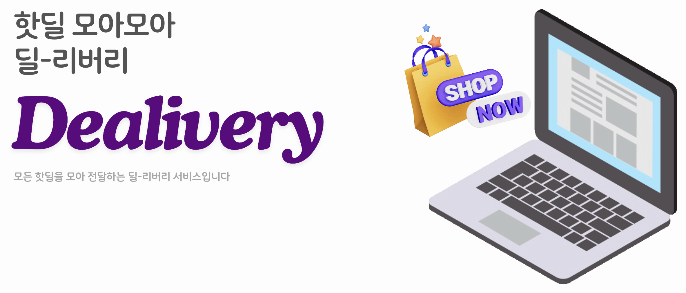
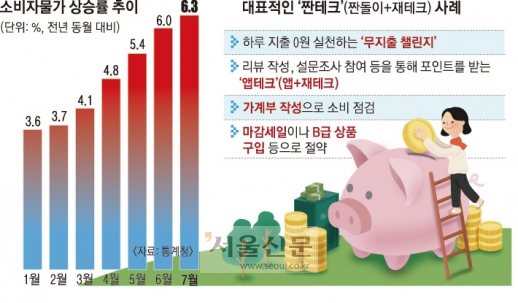
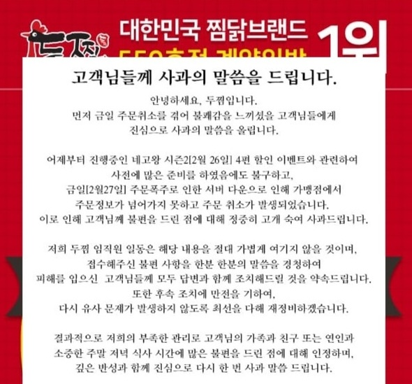
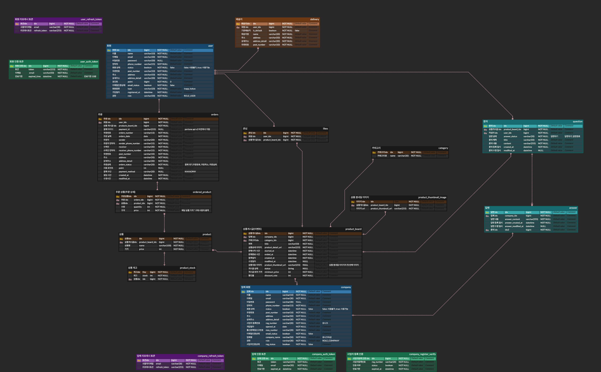
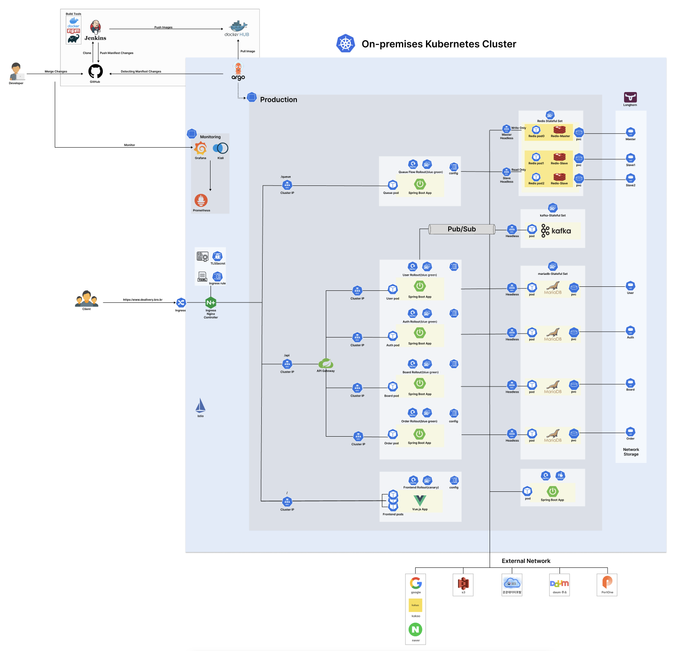

# 🎉 Dealivery - 핫딜만 모아보는 커머스 플랫폼 

  

---
 

### 🏃🏻‍♀️ [Dealivery 데모 사이트 바로가기](https://www.dealivery.kro.kr) 💨 

 

---

# 🧑🏻‍💻 팀원 구성

  <table>
    <tr>
      <th>강태성</th>
      <th>유송연</th>
      <th>오규림</th>
      <th>송나경</th>
      <th>김은선</th>
    </tr>
    <tr>
      <td></td>
      <td></td>
      <td></td>
      <td></td>
      <td></td>
    </tr>
    <tr>
      <td><a href="https://github.com/kangkings">@kangkings</a></td>
      <td><a href="https://github.com/syy0O">@syy0O</a></td>
      <td><a href="https://github.com/ohgyulim">@ohgyulim</a></td>
      <td><a href="https://github.com/NakyungSong">@NakyungSong</a></td>
      <td><a href="https://github.com/kkkeess">@kkkeess</a></td>
    </tr>
  </table>

 

---
# 🔧 기술 스택
 

    
    
    
    

    
    
    
    
    

    
    
    
    

    
    
    
    

    
    
    

 

---
# 🌟 프로젝트 배경

  
  

 

최근 고물가·고금리·고환율의 **'3고(高)'** 현상으로 인해, 소비자들은 최대의 혜택을 얻기 위한 전략적인 소비를 추구하는 경향이 강해졌습니다.  

이에 따라, **한정된 기간 동안 진행되는 이벤트성 판매**에 대한 수요가 급증하고 있습니다.  
하지만, 이러한 이벤트는 개별 웹사이트에서만 진행되어 소비자들이 **핫딜 정보를 일일이 확인해야 하는 불편함**이 있습니다.  

또한, 판매자들은 이벤트 오픈 시 **짧은 시간 동안 몰리는 트래픽**을 효과적으로 처리하지 못하거나, 별도의 시스템 구축이 어려워 **원활한 판매가 힘든 상황**입니다.   

# 🔮 프로젝트 소개
 

`Dealivery`는 이런 불편함을 해소하기 위해 탄생한 **커머스 플랫폼**입니다. 다양한 브랜드와 기업의 이벤트성 판매 정보를 한 곳에 모아, 원하는 상품을 빠르게 찾아 구매할 수 있도록 지원합니다.  

동시에, **판매자에게는 판매 시스템 운영의 부담을 줄이고, 안정적인 환경에서 이벤트 판매에 집중할 수 있는 기회를 제공**합니다.

 

---
# 🗂️ 프로젝트 기획 

 

▶ [**🕙 WBS 바로가기**](https://docs.google.com/spreadsheets/d/1V_-ezMmTGOK4laY1ve3a8Te-wxtgKptLDyJjF0Y9iN8/edit?usp=sharing)

▶ [**📑 요구사항 정의서 바로가기**](https://docs.google.com/spreadsheets/d/1RlGrmpLIaxcx_Qw0ZeBrns0S48W97k64aRxsyCvCU1w/edit?usp=sharing)

 

---
# 📜 프로젝트 설계

 
  

    
<b>📝 ERD</b>
 
        
  

  

    
<b>⚙️ 시스템아키텍처</b>
 
        
  

▶ [**🎨 화면설계서 바로가기**](https://www.figma.com/design/RHr92dX8HXnizNP1vGE1ty/Simkids?node-id=0-1&t=7v4DwQsb6o9BLGLc-1)

▶ [**📃 API 명세서 바로가기**](https://neighborly-honeydew-72a.notion.site/API-2c3644426f3549ef9c36e9e1bdf01bf0)

 

# 📂 개발 폴더로 이동하기

### ▶ [**Backend**](https://github.com/beyond-sw-camp/be06-fin-SimKids-Dealivery/tree/main/backend)

### ▶ [**CI/CD**](https://github.com/beyond-sw-camp/be06-fin-SimKids-Dealivery/tree/main/cicd)

### ▶ [**Frontend**](https://github.com/beyond-sw-camp/be06-fin-SimKids-Dealivery/tree/main/frontend)
