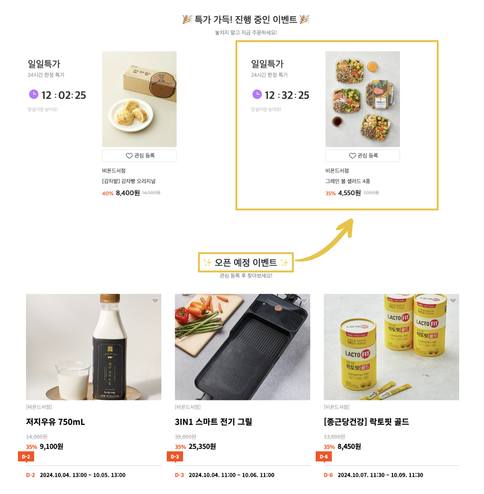

# 🔧 기술 스택
<h4>Backend</h4>

    
    
    

<h4>DB</h4>

    

<h4>DB cache</h4>

    

<h4>Server</h4>

    

<h4>VCS</h4>

    

<h4>OS</h4>

    

----
# 🚀 주요 기술 
##  ⛓️‍💥 MSA
### MSA 전환 과정

### 1. 도메인 기준으로 서비스 분리
MSA 도입의 핵심 목표는 **유지보수와 확장성을 높이고**, **독립적으로 관리 가능한 서비스 구조**를 만드는 것이었습니다. 기존 **Monolithic 구조**는 **서비스 간 결합도가 높아** 작은 수정에도 전체 시스템을 재배포해야 하는 비효율성이 있었습니다.  
이를 개선하기 위해, 각 서비스가 **자신의 역할에만 집중하고 독립적으로 운영**될 수 있도록 **기능별 도메인**으로 분리했습니다. 그 결과, 다음과 같이 4개의 서비스로 나누었습니다.

| 서비스 | 주요 기능 |
| ------ | --------- |
| **회원** | 유저 및 기업 회원 관리 |
| **게시글** | 게시글, 문의, 답변, 관심 기능 처리 |
| **주문** | 주문 및 주문 상품 관리 |
| **인증** | 로그인 및 권한 인증 처리 |

서비스를 분리하면서 각 서비스는 **독립적으로 개발, 배포, 확장**이 가능해졌습니다. 그러나 이로 인해 각 서비스가 **외부에 직접 노출**되는 문제가 생겼습니다. 클라이언트가 각 서비스의 엔드포인트를 알고 있어야 하므로 **보안과 관리의 복잡성**이 증가했습니다.

### 2. Spring Cloud Gateway 도입
외부 노출 문제를 해결하고, **단일한 진입점**을 제공하기 위해 **Spring Cloud Gateway**를 도입했습니다.

- **Gateway**는 클라이언트 요청을 각 서비스로 **라우팅**하고, **인증 및 인가 처리를 중앙에서 관리**합니다.
- 이를 통해 클라이언트는 여러 서비스의 엔드포인트를 몰라도 **하나의 진입점**으로 서비스를 이용할 수 있습니다.

이를 통해 **보안이 강화**되고, **클라이언트와 서비스 간의 통신 구조**가 **단순화**되었습니다. 클라이언트는 더 이상 여러 서비스의 엔드포인트를 알 필요 없이, Gateway를 통해 모든 요청을 처리할 수 있었습니다.

이 접근은 **보안을 강화**하고, **클라이언트와 서비스 간의 통신 구조를 단순화**했습니다.  
그러나 서비스가 여전히 **동일한 데이터베이스를 공유**하는 문제는 남아 있었습니다. 이는 **데이터베이스 스키마 변경 시 모든 서비스에 영향을 줄 수 있는 위험**이 있었습니다.

### 3. DB 분리
**데이터베이스 의존성**을 줄이기 위해 각 서비스마다 **개별적인 데이터베이스**를 구성했습니다.

| 서비스 | 주요 기능 | DB |
| ------ | --------- | --- |
| **회원** | 유저 및 기업 회원 관리 | User DB |
| **게시글** | 게시글, 문의, 답변, 관심 기능 처리 | Board DB |
| **주문** | 주문 및 주문 상품 관리 | Orders DB |
| **인증** | 로그인 및 권한 인증 처리 | Auth DB |

각 서비스는 필요한 **최소한의 정보를 자신의 DB에 저장**하여 **독립적으로 데이터를 관리**할 수 있게 되었습니다.  
그러나 필요한 데이터를 **매번 HTTP 요청으로 주고받는 것은 성능에 부담**을 주는 문제로 떠올랐습니다.

### 4. Kafka를 통한 비동기 통신
HTTP 요청의 성능 문제를 해결하기 위해, **Kafka**를 도입하여 **이벤트 기반 통신**을 구축했습니다.
- Kafka를 통해 **비동기적으로 이벤트를 주고받는 구조**를 만들었고, 이를 통해 서비스 간 데이터 전달을 **보다 효율적으로 전달**할 수 있었습니다.
- 예를 들어, **회원 서비스**에서 회원가입 이벤트가 발생하면, **인증 서비스**가 이를 받아 **로그인에 필요한 정보를 저장**하여, 이후 로그인 요청 시 신속하게 응답할 수 있도록 설계했습니다.

**Kafka의 비동기 처리 방식**은 서비스 간의 통신이 다른 서비스의 성능에 영향을 주지 않도록 하여, **서비스의 독립성을 유지**할 수 있었습니다. 그러나 Kafka를 통한 비동기 처리에서 **데이터 정합성 문제**가 발생했습니다.

### 문제점: 데이터 정합성 문제
- 이벤트가 발행된 시점과 소비된 시점 간의 시간 차이로 인해, 데이터 간 **일관성이 맞지 않는 경우**가 발생했습니다.
- 이로 인해 서비스 간 **데이터 불일치**가 발생할 가능성이 생겼고, 특히 **보상 트랜잭션**을 구현하는 데 어려움을 겪었습니다.

### 향후 계획: SAGA 패턴 및 Axon 프레임워크 도입
**데이터 정합성 문제**를 해결하기 위해, **SAGA 패턴**과 **CQRS**(Command Query Responsibility Segregation) 패턴을 지원하는 **Axon 프레임워크**로의 전환을 계획하고 있습니다.

  

##  📊 대기열 시스템
### Redis를 이용한 대기열 시스템

 

### 분산락

 

## 🔗 기타
### OAuth를 이용한 소셜 로그인 (Google, Kakao, NAVER)

1. OAuth를 통해 소셜 ID로 **사용자 인증**을 진행합니다. 
2. 사용자 정보가 DB에 없는 경우, 해당 소셜 ID로 **회원가입**을 진행하며, 이미 존재하는 경우에는 **JWT를 발급**하여 로그인합니다.
3. 발급된 JWT는 **OauthSuccessHandler**를 통해 **Redis**에 저장되어 사용자 인증 상태 유지 및 토큰 유효성 검증에 활용됩니다.
4. 로그아웃 시, Redis에서 **AccessToken**과 **RefreshToken**을 삭제하여 불필요한 세션을 정리하고 보안을 강화합니다.

 

### 크론잡(CronJob)을 활용한 게시글 상태 자동 변경

게시글은 **진행 전**, **진행 중**, **진행 완료**의 세 가지 상태를 가집니다. 게시글 등록 시 '진행 전' 상태에서 시작하며, 오픈 시간에 맞춰 '진행 중'으로, 종료 시간에 '진행 완료'로 변경됩니다.

이를 자동화하기 위해 **게시글 상태를 주기적으로 업데이트**하는 애플리케이션을 **쿠버네티스의 크론잡(CronJob)** 으로 설정했습니다. 자정부터 30분 간격으로 실행되며, **개입 없이도 자동으로 게시글 상태를 갱신**해, 정확한 시간에 게시글이 열리고 닫히는 기능을 구현했습니다.
