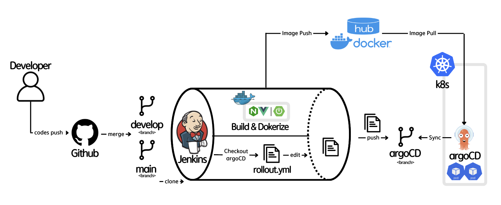

# 🔧 기술 스택
 

    &nbsp;&nbsp;&nbsp;
    &nbsp;&nbsp;&nbsp;
    &nbsp;&nbsp;&nbsp;
    &nbsp;&nbsp;&nbsp;
    &nbsp;&nbsp;&nbsp;

 

---
  
# 🌐 CI/CD  
### 자동화된 CI/CD 파이프라인을 통한 코드 빌드 및 배포 과정

- **Jenkins와 Docker로 빌드 및 컨테이너화**  
코드 변경 시 Jenkins가 자동으로 빌드와 테스트를 수행하고, Docker 이미지를 생성해 일관된 환경에서 패키징 배포 실패율을 줄이고 디버깅 시간을 단축했습니다.

- **ArgoCD를 통해 Kubernetes에 자동 배포**  
GitOps 방식으로 코드 변경 사항을 Kubernetes 클러스터에 자동 배포합니다. 빠른 배포와 이력 관리로, 문제 발생 시 빠른 롤백이 가능해 서비스 가용성을 높이고 다운타임을 줄였습니다.

 

### 롤링 업데이트를 통한 무중단 배포

- **프론트엔드 ➡️ 까나리 배포**  
프론트엔드는 까나리 배포를 통해 트래픽을 단계적으로 이동시켜, 새로운 버전의 안정성을 실시간으로 검증하며 리스크를 최소화했습니다.

- **백엔드 ➡️ Blue/Green 배포**  
백엔드는 Blue/Green 배포를 통해 기존과 새로운 환경을 동시에 운영하며, 안정성을 검증한 후 빠르게 전환해 롤백 시의 영향도를 최소화했습니다.
